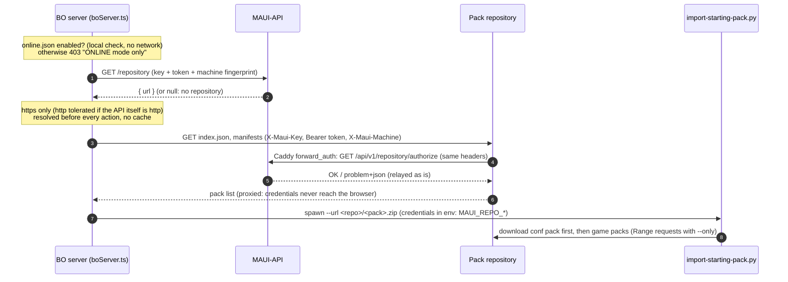

# Pack repository (ONLINE mode)

Game packs and the configuration pack (`mame-conf-pack.zip`) are downloaded from the pack repository ([maui-repository](https://github.com/Arcadoolic/maui-repository)). The cabinet never stores the repository URL or dedicated credentials: everything goes through ONLINE mode and MAUI-API.

- **Source of truth**: `online.json` (`~/.mame-awesome-ui/`) holds the MAUI-API URL, key and token; the repository URL comes from `GET /repository` (`src/class/RepositoryAuth.ts`).
- **Token protection**: redirects are refused (Node `redirect: 'error'`, custom handler in the Python script), and credentials go through the script's environment, never argv (`ps`).
- **Order**: the configuration pack is reinstalled before every game pack import; the game pack list stays locked until `catver.ini`, `genre.ini` and `Multiplayer.ini` are installed (`src/class/ConfPack.ts`).
- **OFFLINE cabinets** have no repository access and no manual pack upload in the BO: they are set up by hand.

## See also

- Repository side (hosting, publishing packs, the Caddy container): [`maui-repository/docs/STARTER-PACK-REPO.md`](https://github.com/Arcadoolic/maui-repository/blob/develop/docs/STARTER-PACK-REPO.md)
- Design decision: maui-api `docs/DECISIONS.md` D46
